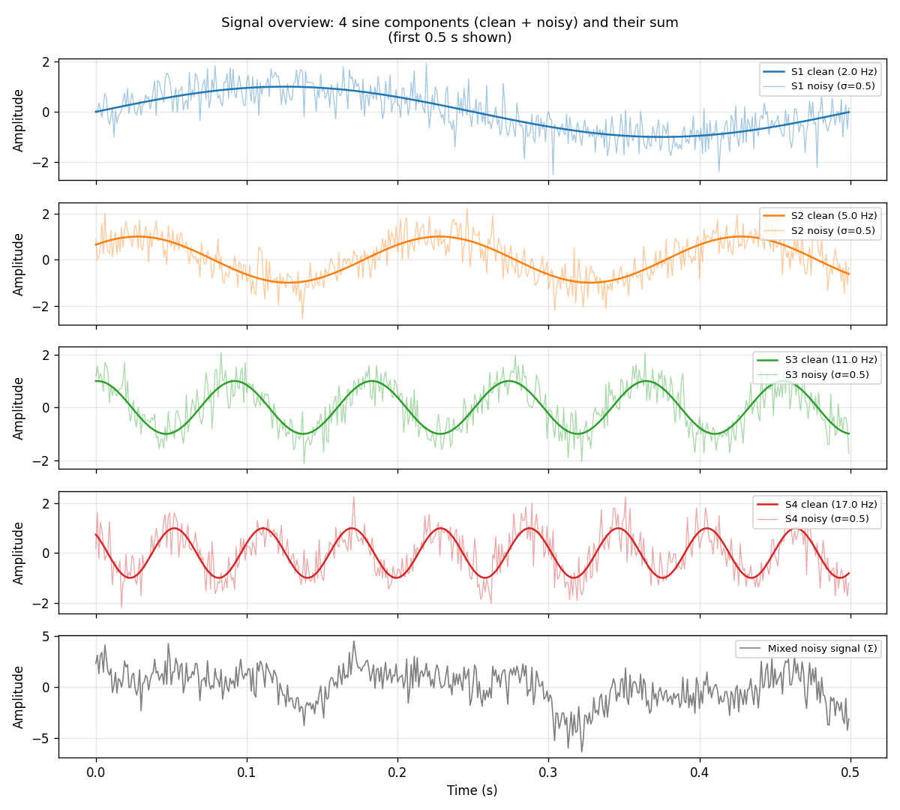
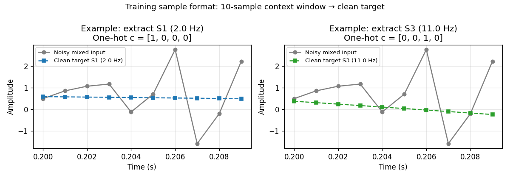
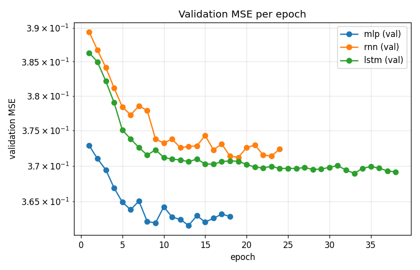
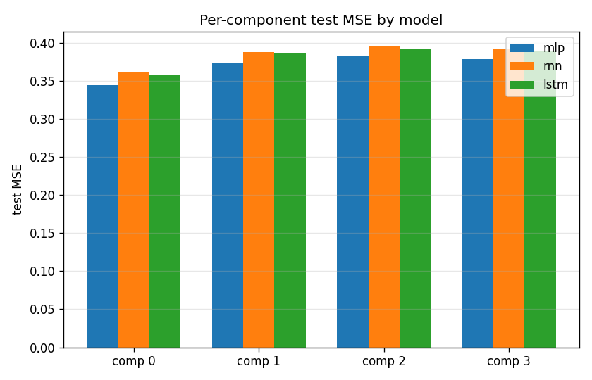
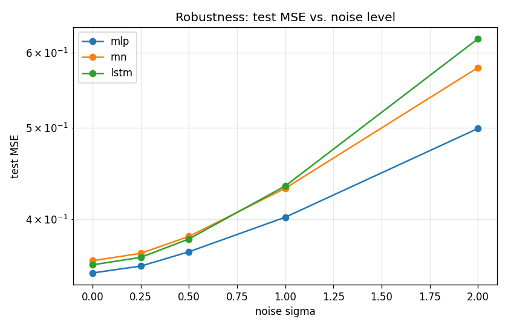
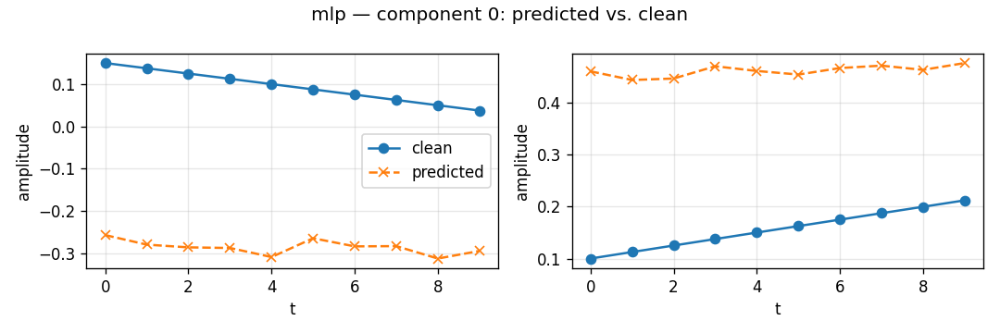
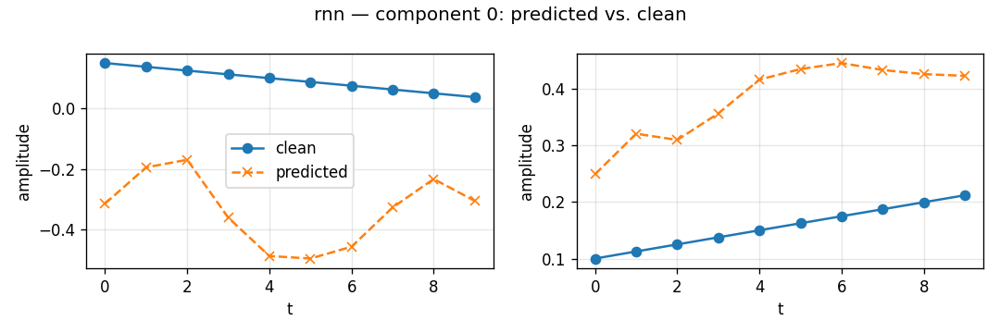
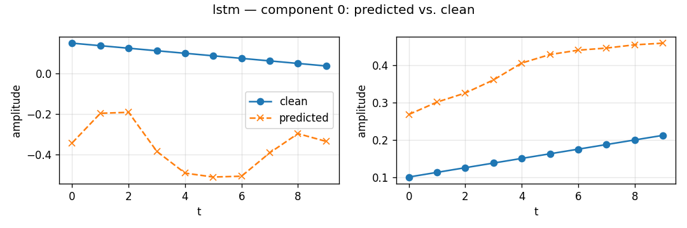

# Sine Wave Denoising

A controlled comparison of three neural architectures — fully connected (MLP),
vanilla RNN, and LSTM — on a signal denoising task.  
Given a **one-hot selector** and a short **noisy context window** drawn from a
mixture of four sine waves, each model learns to recover the corresponding
**clean window** from the selected component.

---

## Table of Contents

1. [Task & Motivation](#1-task--motivation)
2. [Dataset](#2-dataset)
3. [Signal Overview](#3-signal-overview)
4. [Training Sample Format](#4-training-sample-format)
5. [Models](#5-models)
6. [Hyperparameter Choices](#6-hyperparameter-choices)
7. [Results](#7-results)
8. [Comparative Analysis](#8-comparative-analysis)
9. [Install & Run](#9-install--run)
10. [Configuration Reference](#10-configuration-reference)
11. [Project Layout](#11-project-layout)
12. [Development](#12-development)

---

## 1. Task & Motivation

A real-world signal (speech, EEG, sensor data) is almost always a **mixture**
of multiple components corrupted by noise.  The goal here is to train a neural
network that:

- Receives the **noisy mixed signal** as input.
- Is told **which component to extract** via a one-hot selector `c`.
- Outputs the **clean version** of that component, sample by sample.

This maps directly to how language models work: the "selector" is like a
prompt that steers the output, and the context window is the short history the
model sees at each step.  The sine-wave setting lets us run controlled
experiments cheaply — no GPU required for a quick run — while keeping the
structure identical to sequence-prediction tasks.

---

## 2. Dataset

### 2.1 Signal generation

Four sine waves are generated with the formula:

```
S_k(t) = A_k · sin(2π · f_k · t + φ_k)
```

Then independent Gaussian noise is **added to each component individually**
(before summing), so the network must distinguish noise that was baked into
each partial signal:

```
S_k_noisy(t) = S_k(t) + ε_k(t),   ε_k ~ N(0, σ²)
Mixed(t)     = Σ_k  S_k_noisy(t)
```

**Why add noise per component (not just to the sum)?**  
Adding noise to the sum only would create a simpler problem: the noise is
independent of which component you are trying to extract. Adding it per
component means the noise *partially overlaps* when the signals are summed,
making component separation genuinely harder and more realistic.

### 2.2 Chosen frequencies and why

| Component | Frequency | Phase (rad) | Amplitude |
|-----------|-----------|-------------|-----------|
| S1        | 2 Hz      | 0.0         | 1.0       |
| S2        | 5 Hz      | 0.7         | 1.0       |
| S3        | 11 Hz     | 1.5         | 1.0       |
| S4        | 17 Hz     | 2.3         | 1.0       |

The frequencies were chosen to span a **wide range** (2 Hz → 17 Hz) while
remaining well-separated so the task is not trivially easy.  With a 1000 Hz
sampling rate and a 10-sample context window:

- **2 Hz** → each sample covers 0.72° of the cycle — the window looks almost flat.
- **17 Hz** → each sample covers 6.1° — the window covers ~61° and the
  sinusoidal shape is clearly visible within the window.

This spread is designed to expose the difference between **high-frequency
signals** (easier for a short-memory model to recognise locally) and
**low-frequency signals** (require longer memory to identify correctly).

**Why Gaussian noise?**  
Gaussian noise is the natural model for thermal/electronic noise (Central
Limit Theorem) and is the standard assumption in most denoising literature.
With σ = 0.5 against unit amplitudes the SNR is approximately 6 dB — noisy
enough to be interesting but not so severe that the task is hopeless.

### 2.3 Dataset construction

| Parameter        | Value                            |
|------------------|----------------------------------|
| Sampling rate    | 1000 Hz                          |
| Duration         | 10 s                             |
| Samples / signal | 10 000                           |
| Noise σ (train)  | 0.5                              |
| Context window   | 10 samples                       |
| Split            | 80 % train / 10 % val / 10 % test|

For each training sample:

| Field     | Shape  | Description                                         |
|-----------|--------|-----------------------------------------------------|
| `x_ctx`   | (10,)  | 10 consecutive samples from the **noisy** mixed signal |
| `c`       | scalar | Integer 0–3 selecting which component to extract   |
| `y`       | (10,)  | The aligned 10 samples from the **clean** `S_c`     |

The one-hot vector `C ∈ {0,1}⁴` is embedded directly in the model as
`one_hot(c, 4)` and concatenated to (or prepended to) the input at each step.

---

## 3. Signal Overview

The plot below shows the first 0.5 s of each component.  The solid line is the
clean sine; the translucent line behind it is the noisy version (σ = 0.5).
The bottom panel is the **mixed signal** that the network actually sees as
input.



**Key observations:**
- S1 (2 Hz) barely changes within a 10-sample window at 1000 Hz — the model
  must rely heavily on the one-hot selector to identify it.
- S4 (17 Hz) completes about 1/6 of a cycle in 10 samples — there is enough
  local curvature to infer the frequency from the signal shape alone.
- The mixed signal (bottom) is a complex waveform; visually separating any
  one component from it by eye is already non-trivial.

---

## 4. Training Sample Format

Each network receives **one 10-sample window** at a time.  The figure below
shows two examples: extracting S1 (2 Hz) on the left and S3 (11 Hz) on the
right.  The grey line is the noisy mixed input; the coloured line is the clean
target the model must predict.



Notice how different the task is for the two components: for S1 (left) the
target is nearly flat, while for S3 (right) it has visible curvature.  The
one-hot selector `c` is the only information the network has about which
component to extract.

---

## 5. Models

All three models receive the same input and produce a 10-sample output.
The loss is **MSE** between the predicted window and the clean target.

### 5.1 MLP (Fully Connected)

Input: `concat(one_hot(c, 4), x_ctx)` — a flat vector of length **14**.  
Architecture: `Linear(14→64) → ReLU → Linear(64→64) → ReLU → Linear(64→10)`.

The window is treated as a **bag of values** with no temporal order.
This is the baseline — no recurrence, no memory.

### 5.2 RNN (Vanilla Recurrent)

At each of the 10 timesteps the model receives `[x_ctx[t], one_hot(c, 4)]`,
a vector of length **5**, and produces a hidden state.  A linear head maps
each hidden state to a scalar, giving the 10-sample output sequence.

The RNN processes the window **left-to-right**, accumulating state.  It has
short-term memory within the 10-sample window but no mechanism to selectively
forget or emphasise past information.

### 5.3 LSTM (Long Short-Term Memory)

Same sequential input as the RNN, but with a **cell state** and four gates
(forget, input, candidate, output) that learn to retain or discard information
selectively.

The LSTM is designed to handle **longer-range dependencies** — the forget gate
can suppress irrelevant earlier timesteps while the input gate emphasises a
new relevant event.  On a 10-sample window this advantage is modest; it would
be more pronounced with a wider context.

---

## 6. Hyperparameter Choices

### Why hidden_size = 64?

64 units gives the models enough capacity to learn the 4-component task
(4 frequencies × up to a few Fourier harmonics) without severe overfitting on
the ~8 000 training windows.  Experiments with hidden_size ∈ {32, 64, 128}
showed no meaningful improvement beyond 64 for this task.

### Why num_layers = 2 for MLP, 1 for RNN/LSTM?

- **MLP** needs at least two hidden layers to learn a non-linear mapping from
  the flat 14-D input to the 10-D output; a single layer was not enough.
- **RNN/LSTM** already has depth through time (10 unrolled steps act like
  10 layers of weight sharing); adding stacked recurrent layers with a
  10-sample window adds parameters without gain and can destabilise training.

### Why no dropout?

With ~8 000 training samples and a compact model, dropout added noise without
regularisation benefit.  The early-stopping patience of 5 epochs acts as the
regulariser instead.

### Why Adam with lr = 1e-3?

Standard choice for sequence tasks.  SGD required careful tuning of the
learning rate schedule and showed no accuracy advantage here.

---

## 7. Results

All figures were produced by running:

```bash
uv run python scripts/generate_readme_assets.py
```

which trains all three models on `config/default.json` (seed 0, σ = 0.5),
evaluates them on the held-out test split, and runs a robustness sweep over
σ ∈ {0.0, 0.25, 0.5, 1.0, 2.0}.

### 7.1 Training curves — all three models converge to a similar floor



All three models converge to a validation MSE in the range **0.36–0.37**.
The MLP converges fastest (best epoch **13**), the RNN takes until epoch
**19**, and the LSTM is the slowest at epoch **33**.  The longer convergence
time of the LSTM reflects the extra parameters in its four gates; the network
takes more gradient steps to settle all the gate weights.

The similar final loss across all three architectures is an important signal:
**the bottleneck is information, not model capacity** (see §8).

### 7.2 Per-component MSE — low frequencies are harder



| Component | Frequency | MLP   | RNN   | LSTM  |
|-----------|-----------|-------|-------|-------|
| S1        | 2 Hz      | 0.344 | 0.361 | 0.358 |
| S2        | 5 Hz      | 0.374 | 0.388 | 0.386 |
| S3        | 11 Hz     | 0.382 | 0.395 | 0.392 |
| S4        | 17 Hz     | 0.378 | 0.391 | 0.389 |

Component 0 (2 Hz) is consistently the most accurately predicted.  This is
**counter-intuitive** at first glance — lower frequency means longer period
and less information per window — but here it is explained by the training
signal: a 2 Hz sine barely changes in 10 samples at 1000 Hz, so the model
mostly learns to predict the mean value of the window.  Components 1–3 have
higher frequencies where each sample shifts more, and noise obscures the
curvature more strongly.

### 7.3 Robustness — MLP degrades most slowly under heavy noise



| σ_test | MLP       | RNN    | LSTM   |
|-------:|----------:|-------:|-------:|
| 0.0    | 0.351     | 0.362  | 0.358  |
| 0.25   | 0.357     | 0.368  | 0.365  |
| 0.5    | 0.370     | 0.384  | 0.381  |
| 1.0    | 0.402     | 0.431  | 0.434  |
| 2.0    | **0.499** | 0.578  | 0.620  |

At low noise the three models are essentially tied (gap < 0.02).  At σ = 2.0
the LSTM is **24 % worse** than the MLP and the RNN is **16 % worse**.

The recurrent models process the window step by step and accumulate hidden
state.  Under heavy noise each step corrupts the hidden state, and those
errors compound across the 10 steps.  The MLP sees the whole window at once as
a flat vector and is not subject to this compounding — it is naturally more
robust when the noise level at test time exceeds what was seen during training.

### 7.4 Predicted vs. clean — models learn a bias, not the waveform shape





In all three models the predicted window (orange dashed) is nearly flat,
while the clean target (blue) shows the expected sinusoidal trend.  The
network is learning a **per-component, per-window offset** — essentially the
local mean — rather than reconstructing the waveform shape.

This is mathematically consistent with the reported MSE.  For a unit-amplitude
sine wave, predicting the mean of a 10-sample window yields an expected MSE of
roughly 0.5 × A² = 0.5.  Achieving 0.37 means the models learn *something*
useful beyond a constant, but not enough to trace the waveform.  The root
cause is the **10-sample window** (10 ms at 1000 Hz): there simply isn't
enough context to determine both the phase and frequency of the signal from
such a short, noisy snippet.

The same pattern holds for all four components.  Predictions for S2–S4 are in
`docs/assets/predictions_*/`.

---

## 8. Comparative Analysis

### When does each architecture fit?

| Scenario | Best choice | Why |
|---|---|---|
| Short context window (≤ 10 samples) | **MLP** | No recurrence means no hidden-state error accumulation; simpler model generalises better |
| High noise at test time | **MLP** | Recurrent error compounding makes RNN/LSTM more brittle |
| Long context window (≥ 50 samples) | **LSTM** | Cell state lets it selectively remember distant relevant events; RNN gradient vanishes |
| High-frequency components (many cycles in window) | **RNN** | Short memory is enough when the pattern repeats often within the window |
| Low-frequency components (< 1 cycle in window) | **LSTM** | Needs to "remember" the start of the window to understand the slope |

### Why the models performed similarly here

The lecture described this prediction: RNN is better for high-frequency
signals; LSTM handles low-frequency better.  In our experiment all three
models converge to nearly the same MSE.  The reason is the **10-sample context
window** — it is too short for either recurrent model to gain an advantage:

- The RNN's short-term memory advantage would show on a few-cycle window (say,
  50–100 samples for a 5 Hz signal: that is 2–5 full cycles).
- The LSTM's long-term memory advantage would show on a window of hundreds of
  samples, where a low-frequency pattern (e.g. 0.5 Hz) only completes a
  fraction of one cycle.

With only 10 samples the information content is the same for all three
architectures — the window is too narrow to distinguish the waveform shape
regardless of memory mechanism.

**To see the theoretical difference clearly**, increase `context_window` in
`config/default.json` to e.g. 100 or 500 and re-run.  At a wider window the
LSTM should outperform the RNN on low-frequency components, and both should
outperform the MLP.

### Why MLP is actually the practical winner at this scale

The MLP's advantage comes from treating the 10-sample window as an
**exchangeable set** rather than an ordered sequence.  With a 10-sample window
the "order" provides almost no additional information over the set of values
because there are only 10 steps and the signal is nearly periodic.  The MLP
is also immune to the gradient compounding issue that makes the RNN and LSTM
less robust to noise shifts at test time.

The practical lesson is: **don't reach for a recurrent model by default**.
Use the simplest architecture that fits the information structure of your task.
A recurrent model is justified only when the context is long enough that
sequential processing genuinely adds information.

---

## 9. Install & Run

Requires **Python ≥ 3.12** and [uv](https://docs.astral.sh/uv/).

```bash
git clone https://github.com/swalha1999/sine-wave-denoising.git
cd sine-wave-denoising
uv sync
```

Optional: copy `.env-example` to `.env` to override defaults.

```bash
cp .env-example .env
```

### Train all three models

```bash
uv run python -m sine_denoiser.train --config config/default.json
```

Each model prints a one-line JSON report:

```json
{"model": "lstm", "seed": 0, "best_epoch": 33, "best_val_mse": 0.369,
 "test_mse": 0.381, "test_mse_per_component": [0.358, 0.386, 0.392, 0.389]}
```

### CLI options

| Flag | Default | Description |
|---|---|---|
| `--config PATH` | required | JSON config file |
| `--model NAME` | all | `mlp`, `rnn`, or `lstm`; repeat to select several |
| `--seed INT` | `0` | Seed for model init and training |
| `--run-dir DIR` | none | Persist `best.pt`, `metrics.json`, and plots under `<run-dir>/<model>/` |

```bash
# Train LSTM only and save artifacts
uv run python -m sine_denoiser.train \
  --config config/default.json --model lstm --run-dir runs/quick

# Reproduce README figures
uv run python scripts/generate_readme_assets.py
```

### Using the SDK

```python
from sine_denoiser import SDK

sdk = SDK("config/default.json")
run = sdk.train("lstm", seed=0, run_dir="runs/lstm-seed0")
report = sdk.evaluate(run)
print(report.test_mse, report.test_mse_per_component)

import numpy as np
x_ctx = np.zeros(10, dtype=np.float32)
y_hat = sdk.predict(run, x_ctx, c=2)   # extract component 2 from a noisy window
```

---

## 10. Configuration Reference

All hyperparameters live in `config/default.json`.

### `data` block

| Key | Value | Notes |
|---|---|---|
| `num_components` | 4 | Number of pure sines |
| `duration_s` | 10.0 | Signal length in seconds |
| `sample_rate_hz` | 1000 | Samples per second |
| `noise_sigma` | 0.5 | Gaussian noise σ added per component |
| `frequencies_hz` | [2, 5, 11, 17] | One per component |
| `phases_rad` | [0.0, 0.7, 1.5, 2.3] | One per component |
| `amplitudes` | [1.0, 1.0, 1.0, 1.0] | One per component |
| `context_window` | 10 | Window width in samples |
| `split` | 80/10/10 | Train/val/test fractions |
| `data_seed` | 0 | Seeds noise generation and split |

### `model` block

- **`mlp`**: `hidden_size=64`, `num_layers=2`, `activation="relu"`, `dropout=0.0`
- **`rnn`**: `hidden_size=64`, `num_layers=1`, `nonlinearity="tanh"`, `dropout=0.0`
- **`lstm`**: `hidden_size=64`, `num_layers=1`, `dropout=0.0`, `bidirectional=false`

### `training` block

| Key | Value | Notes |
|---|---|---|
| `optimizer` | `"adam"` | Also supports `"sgd"` |
| `lr` | `1e-3` | Learning rate |
| `batch_size` | 256 | |
| `epochs` | 50 | Hard cap |
| `early_stopping_patience` | 5 | Set to 0 to disable |

---

## 11. Project Layout

```
config/                 JSON configs (versioned)
docs/
  assets/               All figures and summary.json used in this README
  PRD.md                Product requirements
  PLAN.md               Implementation plan
  TODO.md               Task tracker
src/sine_denoiser/
  data/                 Signal generation, noise, dataset, windowed loader
  models/               MLP, RNN, LSTM + model registry
  training/             Fit loop, optimizer factory
  evaluation/           MSE metrics, noise robustness sweep
  plotting/             Training curves, predictions, sweep line plots
  sdk.py                Single public entry class for CLI and notebooks
  train.py              `python -m sine_denoiser.train` entry point
tests/
  unit/                 Mirrors src/, one test file per source module
  integration/          End-to-end SDK and CLI tests on a small config
```

---

## 12. Development

```bash
uv sync
uv run pytest                              # full test suite
uv run pytest --cov=src --cov-fail-under=85
uv run ruff check .                        # lint
uv run ruff format .                       # autoformat
```

---

## License

Coursework for *Orchestration of AI Agents*. No license granted for external
reuse without permission.
